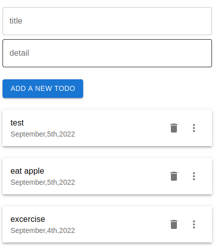
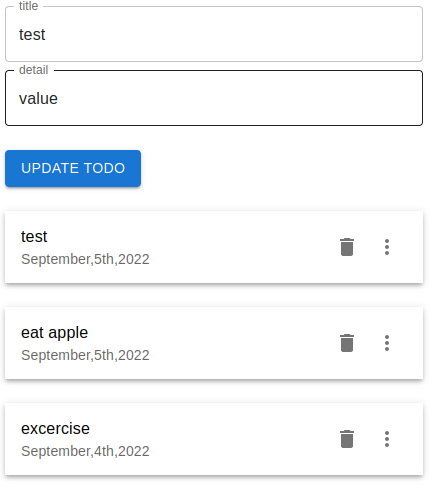

<h1>Todo List</h1>

This is a [Next.js](https://nextjs.org/) project bootstrapped with [`create-next-app`](https://github.com/vercel/next.js/tree/canary/packages/create-next-app).


### About the Project
    This is a Todo list project. We create list of todos, delete and update the todolist using Nextjs. We used  firebase as backend.
## Tools Used
- React
- Nextjs
- Firebase

### React
        ReactJS is a declarative, efficient, and flexible JavaScript library for building reusable UI components.
### Nextjs
        Next.js is a flexible React framework that gives you building blocks to create fast web applications.
### Firebase
        Firebase is an app development platform that helps you build and grow apps and games users love. Backed by Google and trusted by millions of businesses around the world. 
        
# start the  server:
```bash
npm run dev
# or
yarn dev
```
[http://localhost:3000](http://localhost:3000) with your browser to see the result.

# Lets Learn The Project
- Creating a Firebase project
            To setup Firebase, use the following steps: First, go to the Firebase console and Add project. Enter the preferred name of your project, i.e., next-js-todos-app. Then click continue. 
            <br><br>
- Setting up Next.js app
            Open in Terminal. Run the code.
            cd ./your-project-folder-path
            npx create-next-app@latest --ts next-js-firebase-app
            npm install firebase
            npm start
            <br><br>

## How it works 
<h4>Todo Project</h4>
   &emsp; <br>

  <h4>Update the ToDo List</h4>
     &emsp;


## Built by
👤 **Bavithra s**
<!-- - [LinkedIn](hthttps://github.com/pavithra-deepika) -->
- [GitHub](https://github.com/pavithra-deepika)
- [E-mail](pavithradeepika301@gmail.com)

## Conclusion
    Firebase is an incredible tool to get up and running with complex features of a full-stack application. With minimal effort required, we can create a full-stack web application with a live-updating database, an authentication system and cloud functions super easy.

    If you're looking to build a SaaS application or a web-application at lightning pace, Firebase and Next JS provide an amazing toolset to get off the ground and into production with an incredible developer experience.
